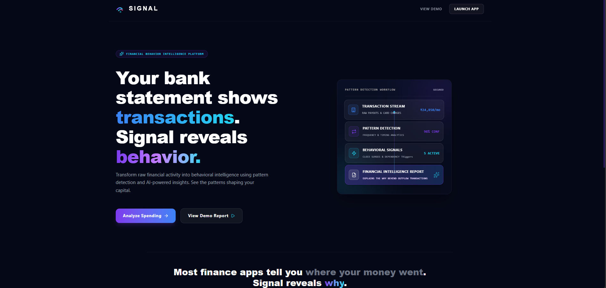

# Signal

Signal is a financial behavior analysis platform that detects spending patterns and generates structured financial reports. Built as an engineering intern assignment project, the application combines a deterministic rules engine with an LLM-based narrative generator to provide explainable financial insights.

---

## Problem Statement

Traditional personal finance tools focus on categorizing historical data (e.g., showing a bar chart of monthly food spending) but fail to explain the **spending patterns** behind the numbers. Users are left to diagnose their own spending habits without understanding the spending patterns—such as recurring expenses, timing patterns, or merchant dependencies—that drive their financial behavior. Furthermore, purely heuristic dashboards lack custom recommendations, while purely LLM-driven applications are prone to mathematical errors and unpredictability when processing large lists of raw transaction data.

---

## Solution Overview

Signal solves this by implementing a structured, two-layer analysis pipeline:

1. **Deterministic Rule Engine (Layer 1):** Scans transaction lists to flag specific spending patterns (e.g., late-night spending, high merchant frequency, category spending concentration) and computes precise percentages and totals.
2. **LLM-Based Synthesis (Layer 2):** Passes the extracted structured signals to a Gemini-powered narrative engine. The LLM translates these technical signals into a structured financial report highlighting key findings, reasoning, impact, and suggested actions.

### User Flow
1. **Upload / Select Dataset:** The user uploads transaction logs or selects a pre-configured profile (e.g., Startup Founder, Spendthrift, Minimalist) on the web dashboard.
2. **Execute Analysis:** The frontend sends transactions to the backend `/analyze` endpoint.
3. **Structured Storage:** The backend runs the deterministic rules, generates the narrative report via Gemini (falling back to local templates if offline), saves the output to a local SQLite database, and returns the results.
4. **Interactive Dashboard:** The user views their calculated Financial Discipline Score, a list of active spending alerts, and the synthesized narrative report.

---

## Features

* **Transaction Analysis:** Parses transaction amounts, categories, merchants, and timestamps.
* **Rule-Based Pattern Detection:** Implements deterministic algorithms to detect recurring spending patterns.
* **LLM-Generated Financial Reports:** Synthesizes structured insights into a professional 4-section report (Key Finding, Reasoning, Impact, and Suggested Action) using Gemini.
* **Fallback Report Generation:** Guarantees uptime by automatically reverting to template-based reporting when Gemini is unavailable.
* **Behavioral Signal Detection:** Highlights up to 4 active spending alerts categorized by severity.
* **Spending Breakdown Analysis:** Automatically calculates and visualizes category concentration percentages.
* **Interactive Dashboard:** A responsive user interface featuring dynamic charts, dashboard views, and local transaction log persistence.

---

## Screenshots

### Landing Page


Description:
Initial upload and dataset selection experience.

### Analysis Dashboard


Description:
Behavioral signals, spending breakdown, and AI-generated financial report.

---

## Architecture

```
                 [ Transaction Data (JSON) ]
                              │
                              ▼
                 [ Rule Engine (rules.py) ]
                              │
                              ▼
        [ Spending Patterns + Calculated Metrics (JSON) ]
                              │
               ┌──────────────┴──────────────┐
               ▼                             ▼
       (Gemini Available?)          (Gemini Offline?)
               │                             │
               ▼                             ▼
      [ Gemini 2.5 Flash ]          [ Fallback Engine ]
      (llm.py Prompt Gen)           (llm.py Templates)
               │                             │
               └──────────────┬──────────────┘
                              ▼
             [ Financial Intelligence Report ]
                              │
                              ▼
                 [ SQLite Database (DB) ]
                              │
                              ▼
                 [ Dashboard UI (React) ]
```

---

## Spending Patterns Detected

* **Category Concentration:** Triggered when a single spending category exceeds 35% of the total monthly expenditure. Highlights areas where spending is concentrated.
* **Merchant Dependence:** Triggered when a single merchant (e.g., Zomato, Uber) accounts for more than 25% of the total transaction count, exposing habitual reliance.
* **Subscription Creep:** Automatically identifies active subscription flows by checking against known premium services (e.g., Slack, AWS, Vercel) or tracking merchants that recur across multiple calendar months.
* **Late-Night Spending:** Flags transactions occurring between 10:00 PM and 5:00 AM, focusing on late-night spending.
* **Weekend Overspending:** Fires when the daily average expenditure on weekends (Saturday & Sunday) exceeds the weekday average by more than 15%, identifying a tendency to overspend during leisure time.

---

## Tech Stack

* **Frontend:** React 19, TypeScript, Vite, Recharts, Framer Motion, TailwindCSS (for base structure), Lucide React
* **Backend:** FastAPI, Python, SQLAlchemy, Uvicorn, Pydantic, Python-dotenv
* **AI Engine:** Gemini 2.5 Flash (`google-generativeai` SDK)
* **Database:** SQLite (SQLAlchemy ORM)
* **Data Format:** JSON transaction lists (demarcated by amount, merchant, category, timestamp)

---

## Project Structure

```
Signal/
├── backend/
│   ├── database.py       # SQLite connection and SQLAlchemy models
│   ├── llm.py            # Gemini 2.5 Flash integration & fallback report engine
│   ├── main.py           # FastAPI server endpoints (CORS, POST /analyze, etc.)
│   ├── models.py         # Pydantic schema validation for API
│   ├── rules.py          # Deterministic rules engine (5 core behavioral rules)
│   └── requirements.txt  # Python package dependencies
├── frontend/
│   ├── src/
│   │   ├── components/   # UI components (Dashboard, UploadZone, etc.)
│   │   ├── data/         # Demo datasets (mockDatasets.ts)
│   │   ├── hooks/        # React custom hooks (useAnalysis.ts)
│   │   ├── lib/          # API communication layer (api.ts)
│   │   ├── App.tsx       # Root component and navigation routing
│   │   └── types.ts      # TypeScript interfaces and types
│   ├── .env              # Frontend API URL configuration
│   ├── package.json      # Frontend package dependencies
│   └── vite.config.ts    # Vite toolchain configuration
├── .gitignore            # Git exclusions (logs, build environments, keys)
└── README.md             # Project documentation (this file)
```

---

## Quick Start

1. Clone repository:
   ```bash
   git clone https://github.com/SunnySatwik/Signal.git
   ```
2. Configure backend `.env` file with `GEMINI_API_KEY=your_key`
3. Start backend:
   ```powershell
   cd backend
   python -m venv venv
   .\venv\Scripts\Activate.ps1
   pip install -r requirements.txt
   uvicorn main:app --reload
   ```
4. Start frontend:
   ```powershell
   cd frontend
   npm install
   npm run dev
   ```
5. Upload a sample dataset or select a demo profile.
6. Review the generated analysis on the dashboard.

---

## Setup Instructions

Ensure you have Python 3.10+ and Node.js 18+ installed on your system.

### 1. Clone the Repository
Open your terminal (PowerShell or Bash) and clone the repository:
```powershell
git clone https://github.com/SunnySatwik/Signal.git
cd Signal
```

### 2. Backend Setup
1. Navigate to the backend directory and create a virtual environment:
   ```powershell
   cd backend
   python -m venv venv
   ```
2. Activate the virtual environment:
   * **Windows PowerShell:**
     ```powershell
     .\venv\Scripts\Activate.ps1
     ```
   * **Bash (macOS/Linux/Git Bash):**
     ```bash
     source venv/bin/activate
     ```
3. Install the required packages:
   ```powershell
   pip install -r requirements.txt
   ```
4. Create a `.env` file in the `backend/` directory to store your Gemini API key:
   ```powershell
   # PowerShell command
   New-Item -Path .env -ItemType File
   Add-Content -Path .env -Value "GEMINI_API_KEY=your_actual_gemini_api_key_here"
   ```
   *(Alternatively, create `backend/.env` in your text editor and add: `GEMINI_API_KEY=your_actual_gemini_api_key_here`)*

### 3. Running the Backend
Start the FastAPI server using Uvicorn:
```powershell
uvicorn main:app --reload
```
The backend API will run on `http://127.0.0.1:8000`. You can inspect the interactive OpenAPI documentation at `http://127.0.0.1:8000/docs`.

### 4. Frontend Setup
1. Open a **new** terminal session, navigate to the frontend directory:
   ```powershell
   cd frontend
   ```
2. Install dependencies:
   ```powershell
   npm install
   ```
3. Create a `.env` file in the `frontend/` directory to map the backend server location:
   ```powershell
   # PowerShell command
   New-Item -Path .env -ItemType File
   Add-Content -Path .env -Value "VITE_API_URL=http://127.0.0.1:8000"
   ```

### 5. Running the Frontend
Start the Vite development server:
```powershell
npm run dev
```
The application will be accessible at `http://localhost:5173`.

---

## Example Input

The endpoint `/analyze` expects a POST body matching the structure below:

```json
{
  "transactions": [
    {
      "amount": 2600.0,
      "merchant": "Zomato",
      "category": "Food",
      "timestamp": "2026-06-03T01:15:00"
    },
    {
      "amount": 15400.0,
      "merchant": "Slack",
      "category": "Subscriptions",
      "timestamp": "2026-06-02T23:45:00"
    },
    {
      "amount": 18500.0,
      "merchant": "Amazon",
      "category": "Shopping",
      "timestamp": "2026-06-01T22:10:00"
    }
  ]
}
```

---

## Example Output

The backend response containing detected signals and the markdown-synthesized report:

```json
{
  "key_finding": "Your monthly outflow is heavily driven by digital subscriptions and high food delivery costs.",
  "signals": [
    {
      "signal": "Subscription Creep",
      "confidence": 0.75,
      "details": "1 active subscription service(s) identified: Slack. Combined monthly spend on these services totals ₹15,400. Subscription costs tend to be overlooked because they're small individually but can accumulate into a significant fixed monthly outflow."
    },
    {
      "signal": "Late-Night Spending",
      "confidence": 0.99,
      "details": "3 of 3 transactions (100%) occurred between 10 PM and 5 AM, totalling ₹36,500. Ordering food or making purchases late at night often reflects convenience-driven habits."
    }
  ],
  "report": "### Key Finding\nYour monthly outflow is heavily driven by digital subscriptions and high late-night convenience purchases.\n\n### Reasoning\nYour transaction logs indicate that 100% of analyzed spending occurs overnight, alongside fixed recurring software overhead (₹15,400 on Slack).\n\n### Impact\nThis combination of fixed subscription commitments and nocturnal convenience orders reduces budget flexibility and increases recurring expenses.\n\n### Suggested Action\nImplement transactional cooling-off periods for non-essential overnight purchasing and audit recurring subscriptions monthly."
}
```

---

## Failure Handling

To guarantee the application remains fully functional even in offline mode or when external rate limits are hit:
* **LLM Fallback Processor:** If the `GEMINI_API_KEY` environment variable is missing or the external API call fails, `backend/llm.py` automatically catches the exception and routes the analysis to `_generate_fallback_report()`.
* **Data-Driven Templating:** The fallback engine does not return generic static text. Instead, it parses the details generated by the rule engine (extracting actual rupee values, merchant names, and percentage metrics) and compiles them into a structured markdown report that mimics a generative layout.

---

## Known Limitations

* **Demo Datasets:** The application is designed to ingest and parse structured JSON/CSV upload datasets. It does not integrate with live open banking APIs (e.g., Plaid/Yodlee) for real-time syncing.
* **Hidden Charting Module:** The historical spending trend chart in the dashboard has been intentionally disabled (`shouldShowChart = false` in `Dashboard.tsx`) pending a visual refinement pass.
* **Heuristic Scoring:** The calculated Financial Discipline Score is computed using lightweight heuristic equations based on signal frequencies and severity metrics rather than actuarial or institutional underwriting credit models.
* **Predefined Detection Scope:** Current behavioral detection is limited to predefined rules and may not identify novel spending patterns without additional rule development.

---

## Future Improvements

* **Bank API Integration:** Connect live accounts securely using OAuth protocols.
* **Multi-Month Trend Analysis:** Extend the rules engine to detect changes in behavioral habits over time (e.g., tracking if "Late-Night Spending" is declining month-over-month).
* **Predictive Outflow Forecaster:** Add predictive modeling to forecast upcoming subscription renewals and cash flow dry spells.

---

## Assignment Compliance

| Assignment Requirement | Platform Implementation | Details & Location |
| :--- | :--- | :--- |
| **1. Successful Installation** | Detailed PowerShell & Bash instructions | Documented step-by-step setup in the Setup Instructions section. |
| **2. Rule-Based Pattern Logic** | Deterministic Python Rules Engine | Built 5 distinct signal detection functions in rules.py. |
| **3. LLM-Based Reasoning** | Gemini 2.5 Flash Narrative Engine | Generates a 4-part intelligence report via API calls in llm.py. |
| **4. Uptime Fallback Handling** | Deterministic Fallback Report Engine | Implements natural-language templating in `_generate_fallback_report()` if API key is absent. |
| **5. Document Limitations** | Known Limitations Section | Explicitly documents the disabled chart, heuristic score, predefined rules scope, and demo data. |
| **6. Architecture Diagram** | Detailed ASCII Data-Flow Map | Outlines the data flow from transaction upload to the React dashboard. |
| **7. Engineering Decisions** | Engineering Decision Note | Dedicated section detailing the Hybrid architecture and associated tradeoffs. |

---

## Engineering Decision Note

**Decision:** Hybrid Rule Engine + LLM Architecture

**Why:**
Combining a deterministic rule engine (rules.py) with an LLM (llm.py) ensures mathematical precision and explainability. The rule engine calculates precise metrics (e.g., spending percentages and recurring counts) and extracts structured signals, avoiding the risk of LLM calculation errors or hallucinations. Gemini 2.5 Flash then synthesizes these signals into a professional financial report.

**Tradeoff:**
This design requires maintaining two distinct analysis layers. Introducing a new behavioral rule requires synchronized updates to both rules.py and prompt templates. Furthermore, signal detection is restricted to pre-coded rules, meaning the system cannot identify novel spending patterns without additional rule development.
